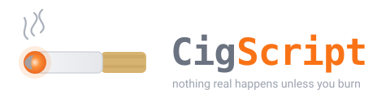

<p align="center">
  
</p>

<p align="center">
  <b>Automation scripts that can't hurt you by accident.</b><br>
  <i>Nothing real happens unless you burn.</i>
</p>

<p align="center">
  <a href="LICENSE"></a>
  <a href="https://github.com/otmof-ops/CigScript/releases/latest"></a>
  
  
  
</p>

CigScript is a small scripting language for the jobs you'd otherwise hand to
a Python file or a bash script: sort a folder, rewrite some JSON, run a
pipeline of commands, ship a build. It has one rule the others don't: **nothing
changes the world outside a `burn { }` block.** Everything else follows from
that rule: a dry-run you can trust, rollback you never wrote, and a run record
that reads like a lab notebook.

```cig
#!/usr/bin/env cig
# Sort loose downloads into folders by extension.
stick root = args[0]
roll plan = {}
for file in fs.list(root) {
  if fs.is_file(file) {
    plan[file] = path.join(root, path.ext(file).lower(), path.base(file))
  }
}
burn {
  for file in plan {
    fs.mkdir(path.dir(plan[file]))
    fs.mv(file, plan[file])
  }
}
exhale "moved ${plan.len()} files"
```

```
$ cig run --dry-run tidy.cig -- ~/Downloads
dry-run plan: 14 ops
     1  reversible    mkdir /home/jay/Downloads/pdf
     2  reversible    move /home/jay/Downloads/paper.pdf -> /home/jay/Downloads/pdf/paper.pdf
     ...
nothing was changed

$ cig run tidy.cig -- ~/Downloads
moved 13 files
burned 14 ops (0 irreversible), run 20260926T031500-3fa9c1

$ cig unburn 20260926T031500-3fa9c1      # changed your mind? put it all back
```

## Why you'd use it

**Dry-run that you can trust.** `--dry-run` runs your script for real and only
*plans* the burns, so the preview is exactly what the real run will do, not a
guess printed by a `--verbose` flag you had to add yourself.

**Rollback without writing any.** Every burn is journaled with a snapshot of
what it's about to change. A script that fails halfway is rolled back
automatically. A run you regret is reversed with `cig unburn <id>`, minutes or
days later. Processes you ran can't be undone, and the plan marks them
*irreversible* so you see them coming.

<p align="center"></p>

**Chains: automation you can light.** Declare an ordered set of sticks and
run them by name from the command line, like a task runner, except the steps
are ordinary functions and the whole chain inherits dry-run and rollback. Yes,
it's called chain smoking. No, it isn't bad for you.

```cig
chain release { fmt, lint, test, build, stamp }
```
```
$ cig chains tasks.cig          # what can I light?
$ cig light tasks.cig release   # light it: timed, logged, stops at the first failure
```

<p align="center"></p>

**Errors that tell you what to do.** Every diagnostic carries a stable code,
points at the source with a caret, and ends with the fix. `cig explain E504`
prints the long version. `cig check` catches typos, reassigned constants and
side effects outside a burn before anything runs. And every failure leads with
the same line, because a runtime should have a catchphrase:

```
Don't see any cigarettes.
error[E701 burn]: fs.rm changes the world, so it must be inside a burn block
  --> tidy.cig:14:5
   |
14 |     fs.rm(stale)
   |     ^^^^^^^^^^^^
  = hint: wrap it: burn { fs.rm(...) }
  = explain: cig explain E701
```

**Batteries that match the job.** `fs`, `path`, `json`, `csv`, `text`
(regex), `proc`, `env`, `time`, `hash`, `math`, `log`, plus 64 methods on
strings, lists and maps. `proc.run` never touches a shell, captures both
streams without deadlocking, and has a timeout by default.

**A runtime that looks after itself.** `cig doctor` reports on the install and
offers to fix what it can, asking first. `cig update` fetches the newest
release, verifies its checksum, and swaps the binary atomically. A crash writes
a redacted report you can read with `cig crash show` and file with one command,
and it never sends anything without asking.

**Determinism you can build on.** Ordered maps, sorted directory listings,
checked integer arithmetic, no random numbers. The same inputs give the same
plan, which is what makes the dry-run worth reading.

## Meet the lexicon

Ten themed words carry the ideas CigScript adds. Everything structural (`if`,
`while`, `for`, `and`, `or`, `not`) is the word you'd expect.

| word | means | because |
|---|---|---|
| `roll x = 1` | a variable | you roll one when you plan to do something with it later |
| `stick x = 1` | a constant | a finished stick is not re-rolled |
| `pull f(a) { }` | a function | you pull on it, you get something back |
| `pack(x) => x` | a lambda | small, portable, hands you one when asked |
| `snuff v` | return | put it out, walk off with what you got |
| `exhale v` | print | what leaves you and enters the room |
| `cough e` | raise | the body's exception handler |
| `try { } ashtray e { }` | catch | where the mess is supposed to land |
| `burn { }` | side effects allowed | the only moment anything actually happens |
| `burn unlit { }` | intent, never executed | in the mouth, never lit |
| `chain name { a, b }` | automation | lighting the next one from the last |

The full field guide, with the frequently muttered questions, is
[docs/SMOKE.md](docs/SMOKE.md). Health note: CigScript contains 0 mg nicotine
and the only thing it's bad for is running scripts you haven't read.

## In the lab

Reads are free, writes need a burn, and every run records the script's hash,
its arguments and every file it touched with the hash of what was there
before. That is a lab notebook that writes itself, and it means a pipeline
that reads `raw/` cannot corrupt `raw/` by accident. Three runnable examples
(summary statistics with a citable report, a dataset manifest with drift
checking, and an analysis pipeline as a chain) are walked through in
[docs/SCIENCE.md](docs/SCIENCE.md).

```
$ cig light examples/lab-pipeline.cig analysis
chain analysis: step 1/5 seed ok (1 ms)
chain analysis: step 2/5 ingest ok (0 ms)
info: clean: kept 6, dropped 1 out-of-range row(s)
chain analysis: step 3/5 clean ok (1 ms)
chain analysis: step 4/5 analyse ok (0 ms)
| series      | n | mean    | sd    |
| pressure    | 3 | 101.2   | 0.3   |
| temperature | 3 | 21.8    | 0.361 |
chain analysis: step 5/5 report ok (1 ms)
```

## Install

Every release ships a Linux x86_64 binary with its SHA-256 and the licence
files beside it; other platforms build from source in about a minute.

```sh
# Review, then run (pinned to a release; never asks for sudo)
curl -fsSL https://raw.githubusercontent.com/otmof-ops/CigScript/v1.0.0/install.sh -o install.sh
less install.sh && sh install.sh
```

The installer checks for the tools it needs, offers to install any that are
missing (and shows you the exact command before it does), verifies the
download, puts `cig` in `~/.local/bin`, offers to add that to your PATH, and
runs `cig doctor`. From source, with a Rust toolchain (1.82+):

```sh
cargo install --git https://github.com/otmof-ops/CigScript --tag v1.0.0 cigscript
```

Then:

```sh
cig doctor          # health, tools, updates, crash reports
cig language        # the whole language on one screen
cig run examples/hello.cig -- world
```

## Sixty-second tour

```cig
roll count = 0                 # a variable
stick limit = 3                # a constant: sticks never change
pull greet(name) {             # a function
  snuff "hi ${name}"           # snuff returns
}
exhale greet("jay")            # exhale prints
for n in 1..4 {                # ranges, lists, maps, strings iterate
  count += n
}
if count > limit { exhale "over" } else { exhale "under" }
try {
  cough "something broke"      # cough raises
} ashtray err {                # ashtray catches
  exhale err.message, err.line
}
stick doubled = [1, 2, 3].map(pack(x) => x * 2)   # pack is a lambda
exhale doubled >> len          # >> pipes the left value into the call
```

Types: `null`, `bool`, `int`, `float`, `string`, `list`, `map`, `function`,
`chain`. Integer overflow, division by zero and out-of-range indexes are
errors, never silent.

## The burn model in one table

| you write | in `cig run` | in `cig run --dry-run` |
|---|---|---|
| `fs.read_text(p)` (a read) | reads | reads |
| `fs.rm(p)` outside a burn | refused before the script starts | refused |
| `burn { fs.rm(p) }` | snapshots `p`, journals, deletes | records "delete p" in the plan |
| `burn unlit { fs.rm(p) }` | records the intent; never deletes | records the intent |
| `burn { proc.run("git", ["gc"]) }` | runs it, journaled as irreversible | records "run git gc" |

Run records live under `~/.cigscript/runs/<id>/`. `cig runs` lists them,
`cig runs <id>` shows one with its journal, `cig unburn <id>` restores one.
What rollback covers, and what it cannot, is written down in
[docs/BURN.md](docs/BURN.md).

## Commands

| command | does |
|---|---|
| `cig run script.cig [-- args]` | check, then run; roll back on failure |
| `cig run --dry-run script.cig` | run with every burn simulated; print the plan |
| `cig check script.cig` | parse and statically check without running |
| `cig chains script.cig` / `cig light script.cig <chain>` | list chains; light one |
| `cig eval "expr"` / `cig repl` | evaluate a snippet; interactive session |
| `cig runs [id] [--prune N]` / `cig unburn <id>` | run records; roll one back |
| `cig explain [code]` | what an error code means and how to fix it |
| `cig doctor [--fix]` | health report; offers repairs, asking first |
| `cig update [--check]` | install the newest release, verified |
| `cig crash [list\|show\|send\|delete]` | crash reports, under your control |
| `cig config [key [value]]` | the few settings there are |
| `cig language` | the legend and the standard library |

`--json` on any command gives machine-readable output; `NO_COLOR` is honoured.
Exit codes are stable: `0` ok, `1` the script failed, `2` it did not parse or
check, `3` usage or environment problem, `70` `cig` itself crashed.

## Documentation

- [docs/LANGUAGE.md](docs/LANGUAGE.md): the language, statement by statement.
- [docs/SMOKE.md](docs/SMOKE.md): the lexicon, explained by a smoker.
- [docs/CHAINS.md](docs/CHAINS.md): chains, the automation layer.
- [docs/BURN.md](docs/BURN.md): effects, modes, the journal, rollback and its limits.
- [docs/SCIENCE.md](docs/SCIENCE.md): CigScript in the lab.
- [docs/STDLIB.md](docs/STDLIB.md): every function with its arity and effect (generated).
- [docs/ERRORS.md](docs/ERRORS.md): every error code, meaning and fix (generated).
- [docs/DESIGN.md](docs/DESIGN.md): why it looks like this, what came before, and the roadmap.
- [examples/](examples/): runnable scripts, all checked and run in CI.

## Status

1.0.0, the first public release. The language surface in `docs/LANGUAGE.md`
and the effect rules in `docs/BURN.md` are the contract. Single-file scripts
for now; imports, `finally`, a formatter and signed releases are on the
roadmap. macOS and Windows binaries arrive with the CI release pipeline;
building from source works on all three today.

## Licensing

- **Code** (`src/`, `tests/`, the build files): [Apache-2.0](LICENSE). In
  plain words: use, copy, change, sell and embed CigScript freely, including
  in closed products; keep the copyright notice and the [NOTICE](NOTICE) file
  with any copy; you get a patent licence from every contributor; and you
  can't use the CigScript name to endorse your derivative.
- **Documentation** (`docs/`, this README, the language specification):
  [CC BY 4.0](LICENSES/CC-BY-4.0.txt). Reuse and adapt with credit.
- **Examples** (`examples/`): [CC0 1.0](LICENSES/CC0-1.0.txt). Paste them
  into your own scripts; no attribution needed.
- **The name.** CigScript is a trademark of Jay Taylor. The keywords and the
  language itself are free for anyone to implement; the name is not free to
  reuse for a fork or product. [TRADEMARKS.md](TRADEMARKS.md) has the full
  policy, which is short and mostly says yes.
- **Your scripts are yours.** Nothing about running `cig` gives this project
  any rights in the `.cig` files you write.

Third-party crates in the binary are listed in
[THIRD-PARTY-NOTICES.md](THIRD-PARTY-NOTICES.md). Contributions are welcome
under a contributor licence agreement; see [CONTRIBUTING.md](CONTRIBUTING.md).
Security reports: [SECURITY.md](SECURITY.md).

Copyright (c) 2026 Jay Taylor (https://github.com/otmof-ops/CigScript).
