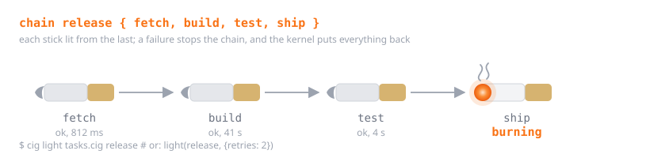

<p align="center">
  
</p>

<p align="center">
  <b>Automation scripts that can't hurt you by accident.</b><br>
  <i>Nothing real happens unless you burn.</i>
</p>

<p align="center">
  <a href="LICENSE"></a>
  <a href="https://github.com/otmof-ops/CigScript/releases/latest"></a>
  
  
  
</p>

> Computers spend their whole lives scrounging ciggies off each other. One
> walks over, covers its eyes, and goes "can't see any ciggies bro, where are
> they at." The other one leans on the wall and says "nar mate, never seen
> any ciggies over HERE before," and neither of them tells you where to
> point. Then something gets deleted, and it's your fault, apparently, and
> you're on trial for it.
>
> **CigScript is the one that points.**
>
> Every effect is a **burn** (a side effect, fenced). Every burn is written
> down *before* it happens (a write-ahead journal), so you can read the
> **plan** first and **unburn** it after (rollback). When it says no, it
> tells you which of the **four kinds of no** it is and where to look, and
> when it doesn't know, it says "I think this, because I checked that."
> Chains light from each other and put everything back when one goes out.
>
> It's a language for people who are sick of piping dry-run in by hand.
> Nobody's on trial. Nobody gets to be a smug bastard. Nicotine: 0 mg.

CigScript is a small scripting language for the jobs you'd otherwise hand to
a Python file or a bash script: sort a folder, rewrite some JSON, run a
pipeline of commands, ship a build. It has one rule the others don't: **nothing
changes the world outside a `burn { }` block.** Everything else follows from
that rule: a dry-run you can trust, rollback you never wrote, and a run record
that reads like a lab notebook.

```cig
#!/usr/bin/env cig
# Sort loose downloads into folders by extension.
stick root = args[0]
roll plan = {}
for file in fs.list(root) {
  if fs.is_file(file) {
    plan[file] = path.join(root, path.ext(file).lower(), path.base(file))
  }
}
burn {
  for file in plan {
    fs.mkdir(path.dir(plan[file]))
    fs.mv(file, plan[file])
  }
}
exhale "moved ${plan.len()} files"
```

```
$ cig run --dry-run tidy.cig -- ~/Downloads
dry-run plan: 14 ops
     1  reversible    mkdir /home/jay/Downloads/pdf
     2  reversible    move /home/jay/Downloads/paper.pdf -> /home/jay/Downloads/pdf/paper.pdf
     ...
nothing was changed

$ cig run tidy.cig -- ~/Downloads
moved 13 files
burned 14 ops (0 irreversible), run 20260926T031500-3fa9c1

$ cig unburn 20260926T031500-3fa9c1      # changed your mind? put it all back
```

## Why you'd use it

**Dry-run that you can trust.** `--dry-run` runs your script for real and only
*plans* the burns, so the preview is exactly what the real run will do, not a
guess printed by a `--verbose` flag you had to add yourself. In the hallway:
*the plan*.

**Rollback without writing any.** Every burn is journaled with a snapshot (a
copy taken *before*) of what it's about to change, and the journal is written
*before* the burn, so a kill mid-burn still leaves a record. A script that
fails halfway is rolled back automatically, newest op first. A run you regret
is reversed with `cig unburn <id>`, minutes or days later. Processes you ran
can't be undone, and the plan marks them *irreversible* so you see them
coming. That label is the honesty guarantee the whole model is trusted
through, and it is never laundered.

<p align="center"></p>

**Chains: automation you can light.** Declare an ordered set of sticks and
run them by name from the command line, like a task runner, except the steps
are ordinary functions and the whole chain inherits dry-run and rollback: one
stick goes out, everything the earlier sticks burned is put back. Each stick
lit from the last. Yes, it's called chain smoking. No, it isn't bad for you.

```cig
chain release { fmt, lint, test, build, stamp }
```
```
$ cig chains tasks.cig          # what can I light?
$ cig light tasks.cig release   # light it: timed, logged, stops at the first failure
```

<p align="center"></p>

**Errors that point.** Every diagnostic carries a stable code, points at the
source with a caret, and ends with *the hint*: what to type next, not what
went wrong. `cig explain E504` prints the long version. `cig check` catches
typos, reassigned constants and side effects outside a burn before anything
runs. And every failure leads with the same line, because a runtime should
have a catchphrase, and because it is the tool admitting its own eyes are
covered, not you:

```
Don't see any cigarettes.
error[E701 burn]: fs.rm changes the world, so it must be inside a burn block
  --> tidy.cig:14:5
   |
14 |     fs.rm(stale)
   |     ^^^^^^^^^^^^
  = hint: wrap it: burn { fs.rm(...) }
  = explain: cig explain E701
```

**Doctor, the one that points.** Under every error, doctor says what it
thinks happened and what it checked to think so, in the only sentence it is
allowed: *I think X, because I checked Y and found Z.* Then the fix, then what
to check if that is not it. Probes are read-only; doctor never fixes anything
on its own. `--no-doctor` gives you the bare diagnostic; `--plain` gives you
the same facts without the jokes. The whole model is in
[docs/DOCTOR.md](docs/DOCTOR.md).

```
  = doctor: I think the program is not on PATH for this run (can't see any ciggies bro), because I checked each directory on PATH, looking for the program named in the message and found no `kubectl` in the 7 directories on PATH.
  = fix: proc.which("name") to check; give the full path, or fix PATH in the environment the run inherits
```

**Batteries that match the job.** `fs`, `path`, `json`, `csv`, `text`
(regex), `proc`, `env`, `time`, `hash`, `math`, `log`, plus 64 methods on
strings, lists and maps. `proc.run` is a *hop* (a process boundary): it never
touches a shell, captures both streams without deadlocking, has a timeout by
default, and is journaled as irreversible because the kernel cannot see
inside it.

**A runtime that looks after itself.** `cig doctor` reports on the install and
offers to fix what it can, asking first. `cig update` fetches the newest
release, verifies its checksum, and swaps the binary atomically. A crash writes
a redacted report you can read with `cig crash show` and file with one command,
and it never sends anything without asking. `cig report <run>` bundles a run
that went wrong *without* crashing the same way.

**Determinism you can build on.** Ordered maps, sorted directory listings,
checked integer arithmetic, no random numbers. The same inputs give the same
plan, which is what makes the dry-run worth reading.

## Meet the lexicon

Ten themed words carry the ideas CigScript adds. Everything structural (`if`,
`while`, `for`, `and`, `or`, `not`) is the word you'd expect. Every word here
has an entry in [docs/LEXICON.md](docs/LEXICON.md) with the manual's name
attached, so you can walk into any forum and recognise what people are
talking about.

| word | means | in the hallway | because |
|---|---|---|---|
| `roll x = 1` | a variable (mutable binding) | "the one you'll change" | you roll one when you plan to do something with it later |
| `stick x = 1` | a constant | "the one you won't" | a finished stick is not re-rolled |
| `pull f(a) { }` | a function definition | "pull on it, get something back" | you pull on it, you get something back |
| `pack(x) => x` | a lambda (anonymous function) | "small, portable, hands you one" | small, portable, hands you one when asked |
| `snuff v` | return | "put it out, take what you got" | put it out, walk off with what you got |
| `exhale v` | print to stdout | "what leaves you and enters the room" | everyone can see it |
| `cough e` | raise an error | "from somewhere deep; interrupts everything" | the body's exception handler |
| `try { } ashtray e { }` | catch | "where the mess lands" | so it doesn't land on the carpet |
| `burn { }` | side effects allowed (the effect fence) | "the only place anything real happens" | the only moment anything actually happens |
| `burn unlit { }` | an intent, never executed (rehearsal) | "in the mouth, never lit" | you look like you mean it, and nothing happens |
| `chain name { a, b }` | automation (an ordered pipeline) | "lighting the next one from the last" | each stick lit from the last; one goes out, the rest are put back |

And at the command line: `cig run --dry-run` is *the plan*, `cig unburn` is
*put it back*, `cig runs` is *the lab notebook*, `cig doctor` is *the one that
points*, `cig report` is *the bundle you attach*. The full field guide, with
the frequently muttered questions, is [docs/SMOKE.md](docs/SMOKE.md). Health
note: CigScript contains 0 mg nicotine and the only thing it's bad for is
running scripts you haven't read.

## In the lab

Reads are free, writes need a burn, and every run records the script's hash,
its arguments and every file it touched with the hash of what was there
before. That is a lab notebook that writes itself, and it means a pipeline
that reads `raw/` cannot corrupt `raw/` by accident. Three runnable examples
(summary statistics with a citable report, a dataset manifest with drift
checking, and an analysis pipeline as a chain) are walked through in
[docs/SCIENCE.md](docs/SCIENCE.md).

```
$ cig light examples/lab-pipeline.cig analysis
chain analysis: step 1/5 seed ok (1 ms)
chain analysis: step 2/5 ingest ok (0 ms)
info: clean: kept 6, dropped 1 out-of-range row(s)
chain analysis: step 3/5 clean ok (1 ms)
chain analysis: step 4/5 analyse ok (0 ms)
| series      | n | mean    | sd    |
| pressure    | 3 | 101.2   | 0.3   |
| temperature | 3 | 21.8    | 0.361 |
chain analysis: step 5/5 report ok (1 ms)
```

## Install

Every release ships a Linux x86_64 binary with its SHA-256 and the licence
files beside it; other platforms build from source in about a minute.

```sh
# Review, then run (pinned to a release; never asks for sudo)
curl -fsSL https://raw.githubusercontent.com/otmof-ops/CigScript/v1.0.0/install.sh -o install.sh
less install.sh && sh install.sh
```

The installer checks for the tools it needs, offers to install any that are
missing (and shows you the exact command before it does), verifies the
download, puts `cig` in `~/.local/bin`, offers to add that to your PATH, and
runs `cig doctor`. From source, with a Rust toolchain (1.82+):

```sh
cargo install --git https://github.com/otmof-ops/CigScript --tag v1.0.0 cigscript
```

Then:

```sh
cig doctor          # health, tools, updates, crash reports
cig language        # the whole language on one screen
cig run examples/hello.cig -- world
```

## Sixty-second tour

```cig
roll count = 0                 # a variable
stick limit = 3                # a constant: sticks never change
pull greet(name) {             # a function
  snuff "hi ${name}"           # snuff returns
}
exhale greet("jay")            # exhale prints
for n in 1..4 {                # ranges, lists, maps, strings iterate
  count += n
}
if count > limit { exhale "over" } else { exhale "under" }
try {
  cough "something broke"      # cough raises
} ashtray err {                # ashtray catches
  exhale err.message, err.line
} finally {                    # runs either way
  exhale "cleanup"
}
stick doubled = [1, 2, 3].map(pack(x) => x * 2)   # pack is a lambda
exhale doubled >> len          # >> pipes the left value into the call
```

Types: `null`, `bool`, `int`, `float`, `string`, `list`, `map`, `function`,
`chain`. Integer overflow, division by zero and out-of-range indexes are
errors, never silent.

## The burn model in one table

| you write | in `cig run` | in `cig run --dry-run` |
|---|---|---|
| `fs.read_text(p)` (a read) | reads | reads |
| `fs.rm(p)` outside a burn | refused before the script starts | refused |
| `burn { fs.rm(p) }` | snapshots `p`, journals, deletes | records "delete p" in the plan |
| `burn unlit { fs.rm(p) }` | records the intent; never deletes | records the intent |
| `burn { proc.run("git", ["gc"]) }` | runs it, journaled as irreversible | records "run git gc" |

Run records live under `~/.cigscript/runs/<id>/`. `cig runs` lists them,
`cig runs <id>` shows one with its journal, `cig unburn <id>` restores one.
What rollback covers, and what it cannot and says so, is written down in
[docs/BURN.md](docs/BURN.md).

## The four kinds of no

When CigScript says no, it tells you which no it is, and where to look. The
vocabulary is the [lexicon's](docs/LEXICON.md#the-four-kinds-of-no); every
code's kind of no is on its `cig explain` page, doctor says it in brackets,
and `--plain` swaps in the manual's name.

| what you hear | whose problem | the manual's name | in CigScript, for example |
|---|---|---|---|
| "can't see any ciggies bro" | yours: you're pointed at the wrong place | wrong address; DNS, path, PATH; `ENOENT` | `E301` unknown name, `E504` index out of range, a missing file under `E508`, a program not on PATH under `E509` |
| "never heard of you" | the door: it doesn't know you | `401` | reserved for hops that authenticate |
| "these are MY ciggies" | the door: it knows you and said no | `403`; a lock; permission denied | `E303` and `E701` effect outside burn, `E302` stick reassigned, `E705` already rolled back, permission denied under `E508` |
| "don't have any over here" | nobody's: right place, right you, nothing there | `404` from the server's side; empty | `E505` missing key, `E703` snapshot missing, `E805` no `gh` or `curl` |

## Break it

CigScript is built to be too robust to break without cheating. So cheat.

Symlinks pointing outside the tree. Kill it mid-burn. Fill the disk. Edit a
file under it while it runs. Yank the power. Fold something that shouldn't
fold. If the kernel ever lies about what it can undo, or loses a file, or
says "aww yea" when it should have said no, I want to know that day.

**When it crashes:** it already wrote a report. `cig doctor` shows what's
saved and what's unsent; say yes and it goes straight to this repo
(redacted; you can read it first). If you'd rather not send it, attach the
file to an issue instead.

**When it's wrong without crashing** (the dangerous kind: exit 0, "file
restored", wrong file): `cig runs` for the run id, then `cig report <run>`
bundles the script's hash, the plan, the journal, the diagnostic and doctor's
diagnosis into one redacted file. Open [a cheat
issue](https://github.com/otmof-ops/CigScript/issues/new?template=cheat.yml)
with the script, the command, what the plan said, and what happened.

**What you get back:** a fix, a regression test with the cheat's name on it,
and a row on the wall below. It will slap.

### The wall

Every row is backed by the test it names; a row may only claim a cheat failed
when that test exists (`tests/docs.rs` checks). Bold is what you're looking
for.

| cheat | result | since | test |
|---|---|---|---|
| effect hidden in a function, a lambda in `.map`, `proc.run` outside a burn | refused, statically and at runtime | 1.0.0 | `effect_hidden_in_a_function_a_lambda_in_map_and_proc_run_outside_a_burn_are_refused` |
| `cough` mid-burn after a write and a delete | rolled back, newest first | 1.0.0 | `cough_mid_burn_after_a_write_and_a_delete_rolls_back_newest_first` |
| `fs.mv` over an existing file, then `unburn` | both files back | 1.0.0 | `mv_over_an_existing_file_then_unburn_brings_both_back` |
| `fs.rm` on a non-empty dir, then rollback | tree and modes restored | 1.0.0 | `rm_on_a_non_empty_dir_then_rollback_restores_tree_and_modes` |
| killed by a signal mid-burn | journal intact, `unburn` restored everything | 1.0.0 | `killed_mid_burn_leaves_the_journal_intact_and_unburn_restores_everything` |
| unbounded recursion | clean `E506` at depth 4000 | 1.0.0 | `unbounded_recursion_is_a_clean_e506` |
| `MAX + 1`, `(MAX + MAX) / 2`, `1.0 / 0.0`, `0.0 / 0.0` | diagnostics, never silent | 1.0.0 | `arithmetic_edges_are_diagnostics_never_silent` |
| delete a symlink, `unburn` | **came back as a regular file**; now a symlink, dangling or not, inside restored trees too | fixed 1.1.0 | `symlinks_roll_back_as_symlinks` |
| random ops over random trees, modes and links, then rollback | byte-identical every time, 60 seeds | 1.1.0 | `rollback_property_over_random_trees` |
| `"x".repeat(i64::MAX)` | **aborted the process**; now `E514`, a diagnostic | fixed 1.1.0 | `allocation_ceiling_is_a_diagnostic_not_an_abort` |
| `-9223372036854775808` as a literal | **lexer rejected it**; now parses | fixed 1.1.0 | `i64_min_is_a_literal_and_the_overflow_next_to_it_is_a_diagnostic` |
| edit a file by hand after the run, then `unburn` | **restored the old snapshot over the edit**; now refused, `E704`, naming the later run when there is one | fixed 1.1.0 | `unburn_refuses_when_a_file_changed_since_the_run_unless_forced` |
| `while true {}` | **hung until killed**; now `E515` "your loop never ends", with the line, after the step budget | fixed 1.1.0 | `while_true_ends_with_your_loop_never_ends_and_a_line` |
| `unburn` the same run twice | **restored the old snapshots over newer work**; now refused, `E705` | fixed 1.1.0 | `unburn_refuses_a_second_time_without_force` |
| delete one snapshot, then `unburn` | **restored half and stopped**; now refused before touching anything, `E703` | fixed 1.1.0 | `unburn_checks_every_snapshot_before_touching_anything` |
| kill it mid-burn, then look | **invisible: status `running`, 0 burns, doctor silent**; now `interrupted`, counted from the journal, offered for `unburn` | fixed 1.1.0 | `interrupted_run_is_recognised_counted_from_the_journal_and_unburnable` |
| a chain error, from `cig light` | **pointed at `file:0:0`**; now the step's own line | fixed 1.1.0 | `chain_failures_point_at_the_step_not_the_light_call` |
| chain dry-run where step 2 reads step 1's write | **open: FAILED at step 2**; the ghost filesystem is the next seam of `HAMMER.md` | open | - |

Add a row. The rules for reporting one are in
[CONTRIBUTING.md](CONTRIBUTING.md#reporting-a-cheat-that-worked).

## Commands

| command | does |
|---|---|
| `cig run script.cig [-- args]` | check, then run; roll back on failure |
| `cig run --dry-run script.cig` | run with every burn simulated; print the plan |
| `cig check script.cig [--deny-warnings]` | parse and statically check without running |
| `cig chains script.cig` / `cig light script.cig <chain>` | list chains; light one |
| `cig eval "expr"` / `cig repl` | evaluate a snippet; interactive session |
| `cig runs [id] [--prune N]` / `cig unburn <id> [--dry-run] [--force]` | run records; put one back |
| `cig explain [code] [--schema]` | the page for an error code: which kind of no, what to type next, the ranked causes; the JSON Schema for a diagnostic |
| `cig doctor [run] [--fix]` | the installation's health, or a stored run's error diagnosed again, read-only; `--fix` asks before each repair |
| `cig report <run> [--out file]` | one redacted file for a bug report: plan, journal, diagnostic, diagnosis, install facts |
| `cig update [--check]` | install the newest release, verified |
| `cig crash [list\|show\|send\|delete]` | crash reports, under your control |
| `cig config [key [value]]` | the few settings there are |
| `cig language` | the legend and the standard library |

`--max-steps N` (or `CIG_MAX_STEPS`) is the step budget: a loop that never
ends is stopped with `E515` and its line; `0` disables it.
`--json` on any command gives machine-readable output (diagnostics follow
[docs/diagnostic.schema.json](docs/diagnostic.schema.json)); `--plain` /
`CIG_PLAIN=1` keeps every fact and drops the catchphrases; `--no-doctor` /
`CIG_DOCTOR=0` gives the bare diagnostic; `NO_COLOR` is honoured. Exit codes
are stable: `0` ok, `1` the script failed, `2` it did not parse or check, `3`
usage or environment problem, `70` `cig` itself crashed.

## Documentation

- [docs/LEXICON.md](docs/LEXICON.md): every word, what it means, the manual's name. The source of truth for the vocabulary.
- [docs/LANGUAGE.md](docs/LANGUAGE.md): the language, statement by statement.
- [docs/DOCTOR.md](docs/DOCTOR.md): automatic diagnosis on every error, and why it never fixes.
- [docs/SMOKE.md](docs/SMOKE.md): the lexicon, explained by a smoker.
- [docs/CHAINS.md](docs/CHAINS.md): chains, the automation layer.
- [docs/BURN.md](docs/BURN.md): effects, modes, the journal, rollback, and what it can't undo and says so.
- [docs/SCIENCE.md](docs/SCIENCE.md): CigScript in the lab.
- [docs/STDLIB.md](docs/STDLIB.md): every function with its arity and effect (generated).
- [docs/ERRORS.md](docs/ERRORS.md): every error code, its kind of no, what to type next, its causes (generated from the registry).
- [docs/DESIGN.md](docs/DESIGN.md): why it looks like this, the tone, what came before, and the roadmap.
- [HAMMER.md](HAMMER.md): the current update package, seam by seam, with the state of each deliverable.
- [examples/](examples/): runnable scripts, all checked and run in CI.

## Status

1.0.0 is the first public release; the language surface in `docs/LANGUAGE.md`
and the effect rules in `docs/BURN.md` are the contract. The next update,
"Hammer" ([HAMMER.md](HAMMER.md)), is landing on `main` one pull request per
seam: the rollback property test, symlink restore, interrupted runs, a
durable journal, the error registry, doctor, the wall. Single-file scripts
for now; imports, a formatter and signed releases are on the roadmap. macOS and Windows binaries arrive with the CI release
pipeline; building from source works on all three today.

## Licensing

- **Code** (`src/`, `tests/`, the build files): [Apache-2.0](LICENSE). In
  plain words: use, copy, change, sell and embed CigScript freely, including
  in closed products; keep the copyright notice and the [NOTICE](NOTICE) file
  with any copy; you get a patent licence from every contributor; and you
  can't use the CigScript name to endorse your derivative.
- **Documentation** (`docs/`, this README, the language specification):
  [CC BY 4.0](LICENSES/CC-BY-4.0.txt). Reuse and adapt with credit.
- **Examples** (`examples/`): [CC0 1.0](LICENSES/CC0-1.0.txt). Paste them
  into your own scripts; no attribution needed.
- **The name.** CigScript is a trademark of Jay Taylor. The keywords and the
  language itself are free for anyone to implement; the name is not free to
  reuse for a fork or product. [TRADEMARKS.md](TRADEMARKS.md) has the full
  policy, which is short and mostly says yes.
- **Your scripts are yours.** Nothing about running `cig` gives this project
  any rights in the `.cig` files you write.

Third-party crates in the binary are listed in
[THIRD-PARTY-NOTICES.md](THIRD-PARTY-NOTICES.md). Contributions are welcome
under a contributor licence agreement; see [CONTRIBUTING.md](CONTRIBUTING.md).
Security reports: [SECURITY.md](SECURITY.md).

Copyright (c) 2026 Jay Taylor (https://github.com/otmof-ops/CigScript).
