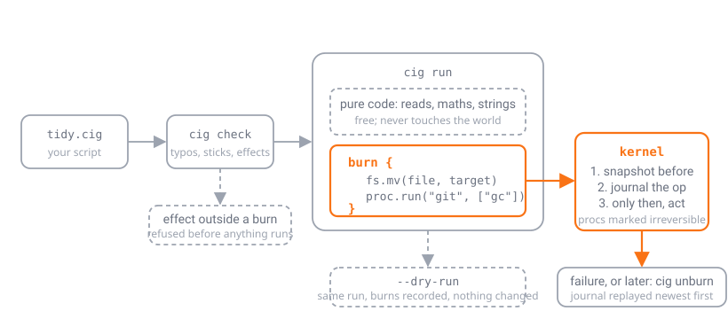

# Burns: effects, modes, the journal and rollback

<p align="center"></p>

The runtime is split into a language, which is pure, and a kernel, which owns
every side effect. This document is the contract for the kernel.

## Effects

Every standard-library function declares one effect:

| effect | examples | needs a burn |
|---|---|---|
| pure | `len`, `json.parse`, `text.replace`, all methods | no |
| read | `fs.read_text`, `fs.glob`, `env.get`, `time.now_ms`, `hash.sha256_file` | no |
| write | `fs.write_text`, `fs.rm`, `fs.mv`, `json.save`, `csv.write` | yes |
| proc | `proc.run` | yes |
| env | `env.set`, `env.unset` | yes |

Reads are free because a dry run has to be able to look at the world to decide
what it would do. Writes, processes and environment changes are the world
changing, and they are only allowed inside a `burn { }` block.

The rule is enforced twice. `cig check` (which `cig run` performs first) walks
the script and refuses any effectful call that is syntactically outside a burn
at the top level, and warns about one inside a function body. At run time every
effectful call asks the kernel for permission, and the kernel refuses unless a
burn block is active on the call stack. A function called from inside a burn
may burn.

## Modes

| mode | effectful calls | run record |
|---|---|---|
| `cig run` | executed after being journaled | `~/.cigscript/runs/<id>/` |
| `cig run --dry-run` | simulated, collected into a plan printed at the end | none |
| `cig check`, `cig eval`, `cig repl` | `check` never executes; `eval` and `repl` behave like `run` without a run directory | none |

Inside `burn unlit { }` every effectful call is simulated whatever the mode,
and the call is recorded as an *intent* rather than a plan entry. Intents are
printed after the run and saved to `intents.jsonl` in the run directory.

A simulated call returns a plausible value so the script can continue:
`fs.write_text` returns the byte count, `proc.run` returns
`{code: 0, out: "", err: "", simulated: true, ...}`. What a dry run cannot do is
read back what a simulated burn would have produced: a script that writes a
file and then reads it will find no file in dry-run mode. Structure scripts to
compute their plan first and burn last, as the examples do.

## The journal

Before an executed op touches the disk, the kernel writes a journal entry with
the state of every path the op will change:

| op | recorded before-state |
|---|---|
| write, append, delete, mkdir | the path: absent, a file (copied to a snapshot with its SHA-256), or a directory (copied as a tree) |
| copy | the destination |
| move | the source as "moved to", and the destination |
| proc, env | nothing; these are marked irreversible |

The journal is `journal.jsonl`, one entry per line, flushed before the op runs.
Snapshots live in `snapshots/` next to it. If the kernel cannot journal an op
(disk full, permissions), the op is refused and nothing is changed.

Directory deletes snapshot the whole tree, so deleting a large directory costs
a copy of it. Moves cost nothing: rollback moves the file back.

## Rollback

Rollback replays the journal newest entry first. For each recorded before-state:

- *absent* → the path is removed if it now exists;
- *file* → the snapshot is copied back;
- *directory* → the current tree is removed and the snapshot tree restored;
- *moved to X* → X is renamed back to the original path.

Irreversible ops (processes, environment changes) are listed under "cannot
undo" so nothing is hidden. Rollback happens automatically when a `cig run`
fails with an uncaught error (disable with `--no-rollback`), and on demand with
`cig unburn <id>`, which works on a run that finished successfully too. The run
record's status becomes `rolled_back` or `unburned`.

## Chains

A chain (`docs/CHAINS.md`) adds nothing to this model and needs nothing from
it: its steps burn like any code, so `cig light --dry-run` plans every step,
a failed chain rolls back everything its earlier steps burned, and
`cig unburn` reverses a chain that finished. The chain report records timing
per step; the journal records the effects.

## Run records

```
~/.cigscript/runs/20260926T021500-3fa9c1/
  run.json        script, its SHA-256, args, cwd, timings, status, burn counts
  journal.jsonl   executed ops with before-states
  snapshots/      copies of files and trees as they were before each op
  intents.jsonl   unlit burns (only when there were any)
```

Run ids sort chronologically (UTC). `cig runs` lists them, `cig runs <id>`
shows one with its journal, `cig runs --prune N` keeps the newest N, and
`CIGSCRIPT_HOME` relocates the whole state directory (tests use this to stay
isolated).

## What this does not promise

- **No sandbox.** A script can read anything the user can read, and a burn can
  run any program. The kernel makes effects explicit and reversible where it
  performed them itself; it does not confine untrusted code.
- **No rollback of what processes did.** `proc.run("rm", ...)` is journaled as
  irreversible. Prefer `fs.rm`, which the kernel can undo.
- **No cross-run consistency.** Rolling back an old run after later runs
  changed the same files restores the old snapshots over the newer content.
  `cig unburn --dry-run` shows what would be restored first.
- **Snapshots are plain copies**, unencrypted, under your home directory. Prune
  them with `cig runs --prune` if they hold anything sensitive.
