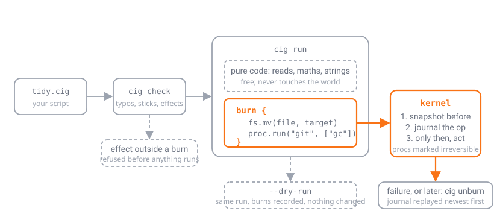

# Burns: effects, modes, the journal and rollback

<p align="center"></p>

The runtime is split into a language, which is pure, and a kernel, which owns
every side effect. This document is the contract for the kernel. The words,
with the manual's name attached (all of them in [LEXICON.md](LEXICON.md)):
*the kernel* (the effect executor, the one piece of code allowed to touch the
world), *a snapshot* (a before-image: a copy taken before the op that will
change it), *the journal* (a write-ahead log: written before each op, so a
kill mid-burn still leaves a record), *newest first* (the order rollback
replays it), *reversible* (the kernel did it itself and has the snapshot to
prove it) and *irreversible* (something the kernel could not watch, and the
plan says so out loud).

## Effects

Every standard-library function declares one effect:

| effect | examples | needs a burn |
|---|---|---|
| pure | `len`, `json.parse`, `text.replace`, all methods | no |
| read | `fs.read_text`, `fs.glob`, `env.get`, `time.now_ms`, `hash.sha256_file` | no |
| write | `fs.write_text`, `fs.rm`, `fs.mv`, `json.save`, `csv.write` | yes |
| proc | `proc.run` | yes |
| env | `env.set`, `env.unset` | yes |

Reads are free because a dry run has to be able to look at the world to decide
what it would do. Writes, processes and environment changes are the world
changing, and they are only allowed inside a `burn { }` block.

The rule is enforced twice. `cig check` (which `cig run` performs first) walks
the script and refuses any effectful call that is syntactically outside a burn
at the top level, and warns about one inside a function body. At run time every
effectful call asks the kernel for permission, and the kernel refuses unless a
burn block is active on the call stack. A function called from inside a burn
may burn.

## Modes

| mode | effectful calls | run record |
|---|---|---|
| `cig run` | executed after being journaled | `~/.cigscript/runs/<id>/` |
| `cig run --dry-run` | simulated, collected into a plan printed at the end | none |
| `cig check`, `cig eval`, `cig repl` | `check` never executes; `eval` and `repl` behave like `run` without a run directory | none |

Inside `burn unlit { }` every effectful call is simulated whatever the mode,
and the call is recorded as an *intent* rather than a plan entry. Intents are
printed after the run and saved to `intents.jsonl` in the run directory.

A simulated call returns a plausible value so the script can continue:
`fs.write_text` returns the byte count, `proc.run` returns
`{code: 0, out: "", err: "", simulated: true, ...}`. What a dry run cannot do is
read back what a simulated burn would have produced: a script that writes a
file and then reads it will find no file in dry-run mode. Structure scripts to
compute their plan first and burn last, as the examples do.

## The journal

Before an executed op touches the disk, the kernel writes a journal entry with
the state of every path the op will change:

| op | recorded before-state |
|---|---|
| write, append | the path: absent, a file (copied to a snapshot with its SHA-256), or a symlink (its target); if the path is a symlink, also the place the bytes land |
| delete, mkdir | the path: absent, a file, a directory (copied as a tree, links kept as links), or a symlink |
| copy | the destination, as for a write |
| move | the source as "moved to", and the destination |
| proc, env | nothing; these are marked irreversible |

A symlink is always recorded as a link, whatever it points at and whether or
not the target exists, and it is restored as a link. Writing through a link
changes the file it points at, so both the link and that file are recorded.

The journal is `journal.jsonl`, one entry per line. Snapshots live in
`snapshots/` next to it. If the kernel cannot journal an op (disk full,
permissions), the op is refused and nothing is changed.

**Durability.** The journal is write-ahead: the snapshot is copied and synced
to disk, the snapshot directory is synced, then the entry is appended and
synced, and only then does the effect happen. A process killed at any point,
or a machine that loses power, leaves a journal that `cig unburn` can replay.
The cost is measured, not guessed: 500 small `fs.write_text` burns in one run
on an ext4 NVMe laptop take about 0.48 s (roughly 1 ms per op), against
0.02 s in 1.0.0, which flushed but never synced. Reads, dry runs and pure
code pay nothing.

Directory deletes snapshot the whole tree, so deleting a large directory costs
a copy of it. Moves cost nothing: rollback moves the file back.

## Rollback

Rollback replays the journal newest entry first. For each recorded before-state:

- *absent* → the path is removed if it now exists;
- *file* → the snapshot is copied to a staging file beside the path and swapped
  in, so a failure half-way leaves what is there untouched;
- *directory* → the snapshot tree is staged beside the path and swapped in;
- *symlink* → a link to the recorded target is recreated;
- *moved to X* → X is renamed back to the original path.

Irreversible ops (processes, environment changes) are listed under "cannot
undo" so nothing is hidden. Rollback happens automatically when a `cig run`
fails with an uncaught error (disable with `--no-rollback`), and on demand with
`cig unburn <id>`, which works on a run that finished successfully too. The run
record's status becomes `rolled_back` or `unburned`.

`cig unburn` checks before it touches anything. Every snapshot the journal
needs must exist and match its recorded SHA-256, and every moved file must
still be where the run put it (or be put back by a later entry's own
rollback). If anything is missing, the whole rollback is refused with `E703`
and nothing is restored; `--dry-run` lists each problem, and `--force`
restores what can be restored and reports the rest.

`cig unburn` is idempotent: a run that was rolled back already is refused with
`E705`, because restoring the old snapshots a second time would overwrite
whatever happened since. `--force` overrides that too, deliberately.

**Interrupted runs.** A run whose process died mid-burn is left with the
status `running` and no totals. `cig runs` recognises it (the pid is gone,
the journal is intact), shows it as `interrupted` with its burn count taken
from the journal, and `cig doctor` reports it with `E706` and, under `--fix`,
offers `cig unburn <id>`.

## Chains

A chain (`docs/CHAINS.md`) adds nothing to this model and needs nothing from
it: its steps burn like any code, so `cig light --dry-run` plans every step,
a failed chain rolls back everything its earlier steps burned, and
`cig unburn` reverses a chain that finished. The chain report records timing
per step; the journal records the effects.

## Run records

```
~/.cigscript/runs/20260926T021500-3fa9c1/
  run.json        script, its SHA-256, args, cwd, timings, status, burn counts
  journal.jsonl   executed ops with before-states
  snapshots/      copies of files and trees as they were before each op
  intents.jsonl   unlit burns (only when there were any)
```

A run's status is one of `running`, `ok`, `failed`, `rolled_back`,
`unburned`, `unburn_failed`, or `interrupted` (derived when a `running`
record's process no longer exists). Burn counts shown by `cig runs` come from
the journal, which is authoritative even when the run never wrote its totals.

Run ids sort chronologically (UTC). `cig runs` lists them, `cig runs <id>`
shows one with its journal, `cig runs --prune N` keeps the newest N, and
`CIGSCRIPT_HOME` relocates the whole state directory (tests use this to stay
isolated).

## What it can't undo, and says so

The irreversible label is the honesty guarantee. It is the one thing that
must never be wrong, because the whole model is trusted through it: a plan
that says *reversible* is a promise the kernel can keep, and a plan that says
*irreversible* is the kernel refusing to launder what it cannot watch. Both
are written before the effect and shown in the plan, the run record and the
rollback report ("cannot undo"). What the label covers:

- **No sandbox.** A script can read anything the user can read, and a burn can
  run any program. The kernel makes effects explicit and reversible where it
  performed them itself; it does not confine untrusted code.
- **No rollback of what processes did.** `proc.run("rm", ...)` is journaled as
  irreversible. Prefer `fs.rm`, which the kernel can undo.
- **No cross-run consistency.** Rolling back an old run after later runs
  changed the same files restores the old snapshots over the newer content.
  `cig unburn --dry-run` shows what would be restored first.
- **Snapshots are plain copies**, unencrypted, under your home directory. Prune
  them with `cig runs --prune` if they hold anything sensitive.
