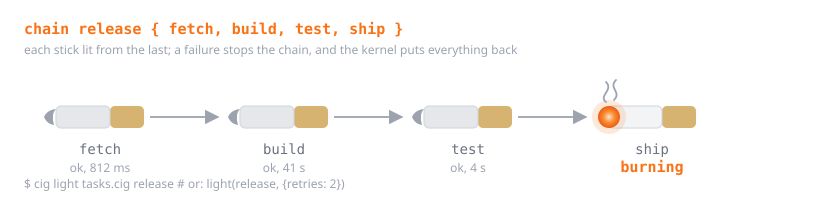

# Chains: automation, one stick after another

<p align="center"></p>

A chain is an ordered list of sticks. Light it and the sticks run one after
another, each timed, each reported, the whole thing stopping at the first
failure unless you say otherwise. Chains are how CigScript does what a
Makefile, a `justfile` or a folder of shell scripts does, with the burn model
underneath: a chain can be dry-run, its burns are journaled, and a failed
chain is rolled back like any other run.

## Declaring one

```cig
stick fetch = pack() {
  burn { proc.run("git", ["pull", "--ff-only"], {check: true}) }
}
stick build = pack() {
  burn { proc.run("cargo", ["build", "--release"], {check: true}) }
}
pull package(prev) {
  burn { fs.cp("target/release/app", "dist/app") }
  snuff "dist/app"
}

chain release {
  fetch
  build
  package
  pack(artifact) => exhale "shipped ${artifact}"
}
```

`chain name { ... }` takes one step per line (commas work too). A step is any
function value: a stick holding a pack, a pull by name, an inline pack, or
another chain. The declaration is a constant, like a stick.

## Lighting one

```cig
stick report = light(release)
exhale report.ok, report.ms, report.steps.len()
```

`light(chain, opts?)` runs the steps in order and returns a report:

| field | meaning |
|---|---|
| `chain` | the chain's name |
| `ok` | true when every step succeeded |
| `ms` | wall-clock time for the whole chain |
| `steps` | one map per step: `name`, `index`, `ok`, `ms`, `retries`, `result`, `error` |
| `failed` | the subset of `steps` that failed |
| `result` | the last step's result |

Options: `{retries: n, retry_delay_ms: m, continue_on_error: bool, quiet: bool}`.

**Values flow forward.** A step that takes one parameter receives the previous
step's result (`null` for the first step). A step that takes none is simply
called. So `package(prev)` above gets whatever `build` returned, and the last
step gets `"dist/app"`.

**Failure stops the chain** and raises an error you can catch:

```cig
try {
  light(release)
} ashtray e {
  exhale "stopped at ${e.step} (#${e.index}): ${e.cause.message}"
}
```

The error carries `chain`, `step`, `index`, `cause` (the step's own error map)
and `steps` (the reports so far). With `{continue_on_error: true}` nothing is
raised; every step runs and `report.failed` tells you which ones failed.

**Retries** re-run a failing step up to `retries` times with `retry_delay_ms`
between attempts, which is what you want around flaky network calls.

**Ad-hoc chains** need no declaration: `light([fetch, build])`.

**Nesting** works: a chain can be a step of another chain, and its report
becomes that step's result.

## From the command line

```
cig chains tasks.cig            # list the chains a file declares, no execution
cig light tasks.cig release     # run the file, then light `release`
cig light --dry-run tasks.cig release
cig light tasks.cig release -- --tag v3
```

`cig light` runs the script's top-level code first (so sticks and chains get
defined, and `args` is set), then lights the chain. Its exit code is 0 when
the chain succeeded and 1 when it failed, and every burn the chain made is in
the run record, so `cig unburn <id>` puts things back.

Each step logs to stderr as it runs:

```
chain release: step 1/4 fetch ...
chain release: step 1/4 fetch ok (812 ms)
chain release: step 2/4 build ...
chain release: step 2/4 build FAILED (3 ms): `cargo` exited with code 101
```

`{quiet: true}` silences that; the report still has everything.

## Why chains and not a task runner file

Because the steps are ordinary CigScript values, a chain can be built at run
time (`light(steps.filter(...))`), a step can be shared between chains, and
the same dry-run and rollback that protect a script protect the chain. There
is no second language to learn for the automation layer; it is the same
language, lit one stick at a time.
